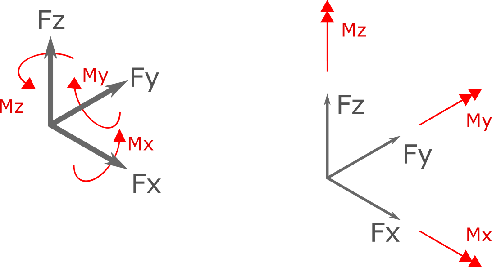

.. _Force:

Force
=====
``Force`` object represents a general concentrated force in 3D (3 force component and 3 moment components).

Fx
---
``Fx`` represents the X component of force

Fy
---
``Fy`` represents the Y component of force

Fz
---
``Fz`` represents the Z component of force

Mx
---
``Mx`` represents the X component of moment

My
---
``My`` represents the Y component of moment

Mz
---
``Mz`` represents the Z component of moment

.. figure:: images/force.png
   :align: center

