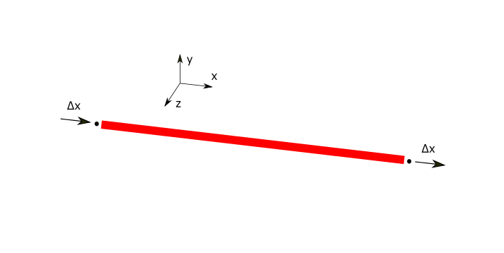
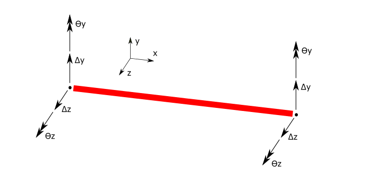

BarElement
==========
A bar element is referred to an 1D element, which only have dimension in one direction.

Behaviours
----------
BarElement have a ``BarElement.Behaviour`` property which is an enum flag - which means can have several values at same time. The possible behaviours for the BarElement is:

- ``BarElementBehaviour.EulerBernoulyBeamY`` : Beam in Y direction based on Euler-Bernouly theory. DoFs are shown in below image:

- ``BarElementBehaviour.EulerBernoulyBeamZ`` : Beam in Z direction based on Euler-Bernouly theory. DoFs are shown in below image:

- ``BarElementBehaviour.TimoshenkoBeamY`` : Beam in Y direction based on Timoshenko's theory (shear deformation). DoFs are shown in below image:

- ``BarElementBehaviour.TimoshenkoBeamZ`` : Beam in Z direction based on Timoshenko's theory (shear deformation). DoFs are shown in below image:

- ``BarElementBehaviour.Truss`` : Only axial load carrying. DoFs are shown in below image:

- ``BarElementBehaviour.Shaft`` : Only torsional moment carrying. DoFs are shown in below image:

These behaviours can be combined, for example a truss member should only have a Truss behaviour, but a 3d frame member does have two beam behaviour in Y and Z directions, a truss behaviour and a shaft behaviour, (all these behaviours at the same time).
 
This is an example which makes a BarElement with truss behaviour which in real acts as a truss member that only can carry axial load:

.. code-block:: cs
   
   var bar = new BarElement();
   bar.Behaviour = BarElementBehaviour.Truss;

There is another utility static class named ``BarElementBehaviours`` which contains predefined combination behaviours for BarElement which is more user (developer) friendly than original enum flag.
This is example usage of ``BarElementBehaviours`` class:

.. code-block:: cs
   
   var bar = new BarElement();
   bar.Behaviour = BarElementBehaviours.FullFrame;

If we did not want use BarElementBehaviours utility, then we had to write like this (in this example both are same):

.. code-block:: cs
   
   var bar = new BarElement();
   bar.Behaviour = BarElementBehaviour.Truss | BarElementBehaviour.BeamYEulerBernoulli | BarElementBehaviour.BeamZEulerBernoulli | BarElementBehaviour.Shaft;

So better to use ``BarElementBehaviours`` unless needed manually define combination of behaviours.

``BarElementBehaviours.FullBeam`` and ``BarElementBehaviours.FullBeamWithShearDefomation``: 

``BarElementBehaviours.FullFrame`` and ``BarElementBehaviours.FullFrameWithShearDeformation``: 
.. image:: ../images/bar-fullFrame.png

Geometrical properties of Bar Element's Cross Section
-----------------------------------------------------

BarElement is modelled as a 1D element, and it needs to have geometrical values of it's cross section (like A, Iy, Iz, etc.).
BarElement.CrossSection property does define it.

Mechanical properties of Bar Element's Cross Section
----------------------------------------------------

Mechanical properties of bar element means the properties on material, like elastic modulus or shear modulus.
BarElement.Material property does set the material property of bar element.

Local Coordination System
-------------------------

Local coordination system for ``BarElement`` has tree axis that we name ``x'``, ``y'`` and ``z'``. 

TODO with images

Relation of global and local system
-----------------------------------

"The global axes are brought to coinside with the local member axes by seauence of rotation about y, z and x axes respectively. This is refered to an y-z-x transformation." ref[0].

Imagine a bar element with start node ``N1`` located at ``(x1, y1, z1)`` and end node ``N2`` located at ``(x2,y2,z2)``. Four steps are needed to find the directions of the local axis x'-y'-z':

- Step 1:
Move the element in a way that ``N1`` be placed at origins of global system.
TODO: Image

- Step 2:
Rotate global system about global Y axis rotated X axis goes under element length (shown as β in image below). Note that if element is vertical (e.g. x1 = x2 and y1 = y2 and z1 ≠ z2) no need to do this step.
TODO: Image

- Step 3:
Rotate the system from previous step about it's Z axis in a way that X axis go exactly through same direction of element's length (shown as γ in image below).
TODO: Image

- Step 4:
If element have any custom web rotation α, do rotate system about it's X axis by α:
TODO: Image

the result system is local system of bar element.

ref[1]: Finite Element Analysis: Theory and Programming by by C Krishnamoorthy p.243