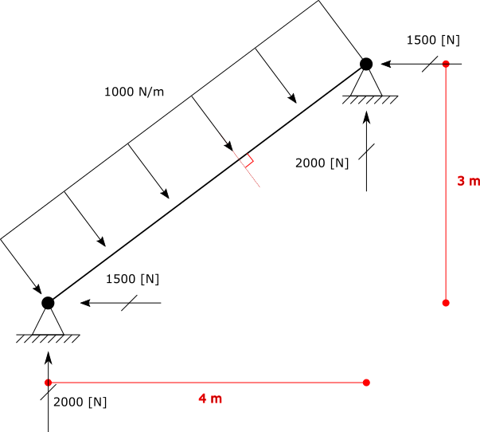

.. _element-load-coordination-system:

Example 5: Element Load Coordination System Example
########################################

The `Loads.UniformLoad` have a property named ``CoordinationSystem`` of enum type `BriefFiniteElementNet.CoordinationSystem` which defines the coordination system of load (for more info see :ref:_UniformLoad-coordination-system).
Using the combination of ``UniformLoad.CoordinationSystem`` and ``UniformLoad.Direction`` property, some specific distributed loads can be applied to elements.

Here are two examples:

Example 1
=========
Consider the inclined frame shown in fig below.

.. figure:: ../images/uload-coord-sys-1.png
   :align: center
   
There is an inclined element of length = ``5 [m]``, and an ``UniformLoad`` of magnitude ``1000 [N/m]``.

+ Magnitude of **1000 [N/m]**
+ Direction of **Z**
+ Coordination System of **Global**

**step 1:** create model, nodes and elements:

.. code-block:: cs

	var m1 = new Model();

	var el1 = new BarElement();

	el1.Nodes[0] = new Node(0, 0, 0) { Constraints = Constraints.MovementFixed & Constraints.FixedRX, Label = "n0" };
	el1.Nodes[1] = new Node(3, 0, 4) { Constraints = Constraints.MovementFixed, Label = "n1" };

	el1.Section = new Sections.UniformGeometric1DSection(SectionGenerator.GetISetion(0.24, 0.67, 0.01, 0.006));
	el1.Material = UniformIsotropicMaterial.CreateFromYoungPoisson(210e9, 0.3);

	var l1 = new Loads.UniformLoad();

	l1.Direction = Vector.K;
	l1.CoordinationSystem = CoordinationSystem.Global;
	l1.Magnitude = 1e3;

	el1.Loads.Add(l1);

	m1.Elements.Add(el1);
	m1.Nodes.Add(el1.Nodes);

	m1.Solve_MPC();

	Console.WriteLine("n0 reaction: {0}", m1.Nodes[0].GetSupportReaction());
	Console.WriteLine("n1 reaction: {0}", m1.Nodes[0].GetSupportReaction()); 

	
result

n0 reaction: F: 0, 0, -2500, M: 0, 0, 0
n1 reaction: F: 0, 0, -2500, M: 0, 0, 0

Example 2
=========
Consider the inclined frame shown in fig below.

   
There is an inclined element of length = ``5 [m]``, and an ``UniformLoad`` of magnitude ``1000 [N/m]``.

+ Magnitude of **1000 [N/m]**
+ Direction of **Z**
+ Coordination System of **Local**

.. code-block:: cs

	var m1 = new Model();

	var el1 = new BarElement();

	el1.Nodes[0] = new Node(0, 0, 0) { Constraints = Constraints.MovementFixed & Constraints.FixedRX, Label = "n0" };
	el1.Nodes[1] = new Node(3, 0, 4) { Constraints = Constraints.MovementFixed, Label = "n1" };

	el1.Section = new Sections.UniformGeometric1DSection(SectionGenerator.GetISetion(0.24, 0.67, 0.01, 0.006));
	el1.Material = UniformIsotropicMaterial.CreateFromYoungPoisson(210e9, 0.3);

	var l1 = new Loads.UniformLoad();

	l1.Direction = Vector.K;
	l1.CoordinationSystem = CoordinationSystem.Local;
	l1.Magnitude = 1e3;

	el1.Loads.Add(l1);

	m1.Elements.Add(el1);
	m1.Nodes.Add(el1.Nodes);

	m1.Solve_MPC();

	Console.WriteLine("n0 reaction: {0}", m1.Nodes[0].GetSupportReaction());
	Console.WriteLine("n1 reaction: {0}", m1.Nodes[0].GetSupportReaction()); 
 

result

n0 reaction: F: 2000, 0, -1500, M: 0, 0, 0
n1 reaction: F: 2000, 0, -1500, M: 0, 0, 0

whole source code exists in the `UniformLoadCoordSystem.cs` file.