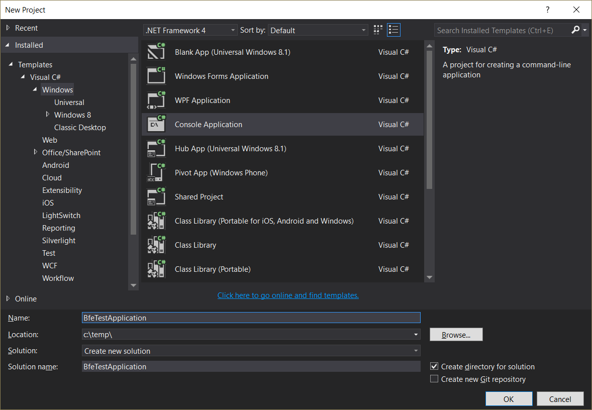
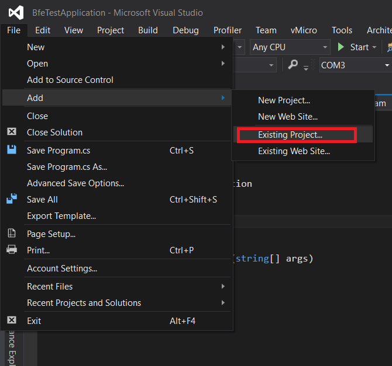
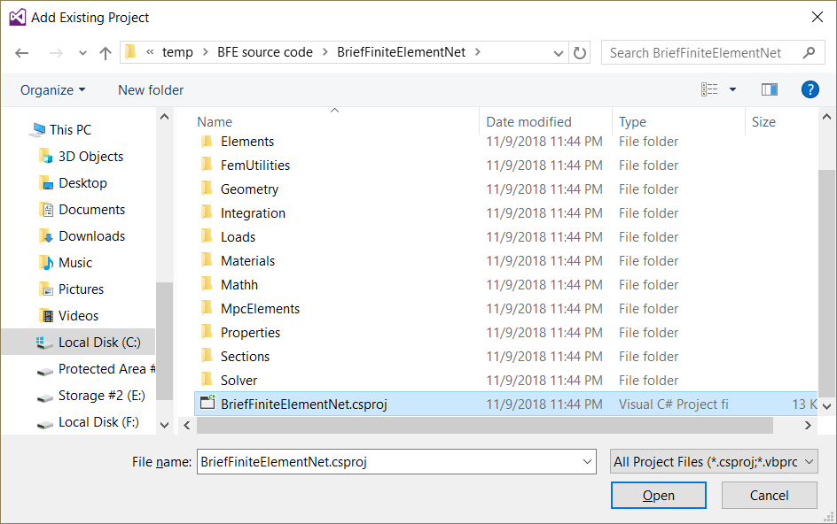
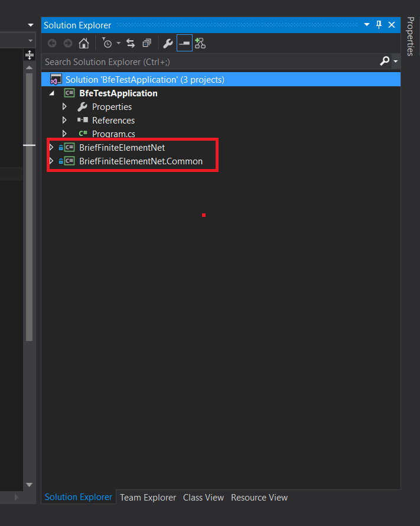

After downloading the source code you should reference the main projects of bfe in your C# project.
we will use Visual Studio 2015 in next. you can use any version of Visual Studio IDE including free express or community version. by the way it is downloadable from ``https://visualstudio.microsoft.com/``.
In next we will use visual Studio 2015...

After installation, Create a new C# application ([More Info](https://docs.microsoft.com/en-us/visualstudio/ide/creating-solutions-and-projects?view=vs-2017))

then to add BFE code to your solution, do the following:
1- In Solution Explorer, select the solution. 
2- On the File menu, point to Add, and click Existing Project.
3- In the Add Existing Project dialog box, locate the project you want to add, select the project file, and then click Open.

you should add two projects to your solution:
1- BriefFiniteElementNet located at ``<root folder>\BriefFiniteElementNet\BriefFiniteElementNet.csproj``
2- BriefFiniteElementNet.Common located at ``<root folder>\BriefFiniteElementNet.Common\BriefFiniteElementNet.Common.csproj``

adding two projects,

   

   
.. figure:: ../images/add-proj-bfe-common
   :align: center
   
after adding two projects, solution explorer tab in visual studio should looks like this:

