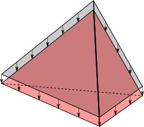
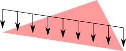
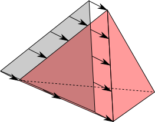

UniformLoad
============
``UniformLoad`` is a constant distributed load which can apply on 1D (like ``BarElement``), 2D (like ``TriangleElement``) or 3D (like ``TetrahedronElement``) elements. Self weight loads are good examples that can be modeled with this type of load.

Here are examples illustrated in image:

.. figure:: images/uload-body-bar.png
   :align: center
   ``UnformLoad`` applying on a ``BarElement``'s body

   .. figure:: images/uload-body-triangle.png
   :align: center
   ``UnformLoad`` applying on a ``TriangleElement``'s body
   

   ``UnformLoad`` applying on a ``TetrahedronElement``'s body

   ``UnformLoad`` applying on one of a ``TriangleElement``'s edges

   ``UnformLoad`` applying on one of a ``TetrahedronElement``'s faces

.. figure:: images/uload-edge-tetra.png
   :align: center
   ``UnformLoad`` applying on one of a ``TetrahedronElement``'s edges

Magnitude
---------

``UniformLoad.Magnitude`` which is a ``double`` property of ``UniformLoad``, defines the Magnitude of uniform load. Based on ``UniformLoad`` is applied on what element, the dimension is different:
	- If it is applied on a 1D element like ``BarElement``, then the dimension is [N/m]
	- If it is applied on a 2D element like ``TriangleElement``, then the dimension is [N/m^2]
	- If it is applied on a 3D element like ``TetrahedronElement``, then the dimension is [N/m^3]

Coordination System
-------------------

``UniformLoad.CoordinationSystem`` which is a enum typed property of ``UniformLoad``, defines the coordination system of uniform load. It can only have two different values of ``CoordinationSystem.Global`` or ``CoordinationSystem.Local``:
	- ``CoordinationSystem.Global``: The load is assumed in global coordination system
	- ``CoordinationSystem.Local``: The load is assumed in local coordination system of element that load is applied to (each element type have different local coordination system which is stated in appropriated section).

Look at examples section for more information on how to use.

Direction
---------

``UniformLoad.LoadDirection`` which is a enum typed property of ``UniformLoad``, defines the direction of uniform load. It can only have three different values of ``LoadDirection.X`` or ``LoadDirection.Y`` or ``LoadDirection.Z``.
 Look at examples section for more information on how to use.

TODO: obsolete the enum LoadDirection and use a vector for more enhanced usage.

Examples
--------

Example 1 (BarElement)
^^^^^^^^^^^^^^^^^^^^^^
adding a ``UniformLoad`` with :

+ Magnitude of **100 [N/m]**
+ Direction of **X**
+ Coordination System of **global**

to a ``BarElement``:

.. code-block:: c++
   
   var bar = new BarElement();			//creating new instance of element
   var load = new UniformLoad();		//creating new instance of load
   load.Magnitude = 100;				//set Magnitude
   load.Direction = LoadDirection.X;	//set direction
   load.CoordinationSystem = 
       CoordinationSystem.Global;		//set coord system
   
   bar.Loads.Add(load);					//apply load to element

TODO: Image

Example 2 (BarElement)
^^^^^^^^^^^^^^^^^^^^^^

adding a ``UniformLoad`` with :
	- Magnitude of **100 [N/m]**
	- Direction of **X**
	- Coordination System of **local**

to a ``BarElement``:

.. code-block:: c++
   
   var bar = new BarElement();			//creating new instance of element
   var load = new UniformLoad();		//creating new instance of load
   load.Magnitude = 100;				//set Magnitude
   load.Direction = LoadDirection.X;	//set direction
   load.CoordinationSystem = 
       CoordinationSystem.Local;		//set coord system
   
   bar.Loads.Add(load);					//apply load to element

TODO: Image to show load direction

Example 3 (TriangleElement)
^^^^^^^^^^^^^^^^^^^^^^^^^^^

Adding a ``UniformLoad`` with :
	- Magnitude of **100 [N/m]**
	- Direction of **Z**
	- Coordination System of **global**

to a ``TriangleElement``:

.. code-block:: c++
   
   var bar = new TriangleElement();		//creating new instance of element
   var load = new UniformLoad();		//creating new instance of load
   load.Magnitude = 100;				//set Magnitude
   load.Direction = LoadDirection.Z;	//set direction
   load.CoordinationSystem = 
       CoordinationSystem.Global;		//set coord system
   
   bar.Loads.Add(load);					//apply load to element

TODO: Image to show load direction